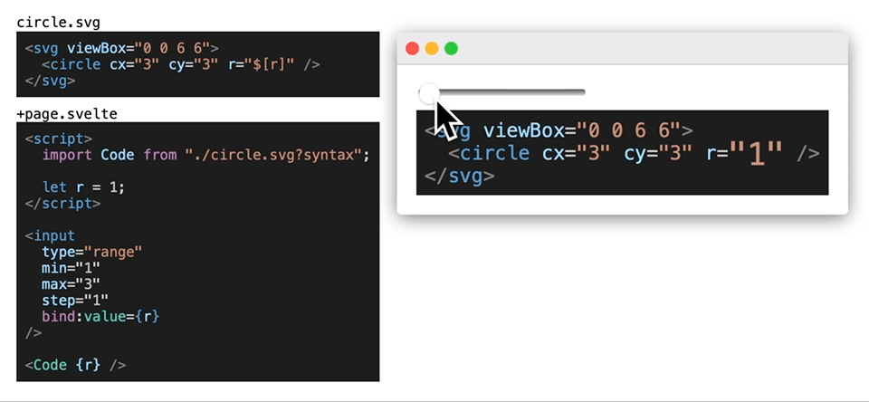

# rollup-plugin-syntax-highlight-svelte

Import code as syntax highlighted Svelte components using Rollup or Vite.

Works like the [Special Assets](https://vitejs.dev/guide/features.html#static-assets) loaders in Vite. By appending `?syntax` to the import path, you will import a Svelte component with the highlighted HTML code. The component also support [substitutions](#substitutions)!

Uses [Shiki](https://github.com/shikijs/shiki) for highlighting.



## Installation

```
npm i -D rollup-plugin-syntax-highlight-svelte
```

## Usage

Add to `plugins` in `rollup.config.js` or `vite.config.js`.

```js
import { syntaxHighlight } from "rollup-plugin-syntax-highlight-svelte";

export default {
  plugins: [syntaxHighlight()],
};
```

You can now import Svelte component with the highlighted code by appending `?syntax` to the path.

```html
<script>
  import CodeSample from "./code-sample.ts?syntax";
</script>

<CodeSample />
```

## Substitutions

By inserting `$[PROP_NAME]` into your highlightable code, you can substitute that with a value you pass into the component.

```xml
<svg viewBox="0 0 5 5">
  <circle cx="2.5" cy="2.5" r="$[r]" />
</svg>
```

```html
<Component r="5" />
```

### Alias

What you set as PROP_NAME will be used as the default value, and Shiki uses that to figure out how to highlight the code. Sometimes it will highlight things incorrecly. Then you can use the format `$[let:declaration]` to use `let` as default value, and `declaration` as prop name.

```js
declaration name; // $[declaration] name;
let name; // $[let:declaration] name
```

## Options

Same options as [`shiki.getHighlighter`](https://shiki.matsu.io).

```js
syntaxHighlight({
  theme: "code-dark",
});
```

In addition, it supports the option `mapExtension`. It allows you to specify formatting for extensions Shiki doesn't recognise.

```js
syntaxHighlight({
  mapExtension: {
    svg: "xml",
  },
});
```

In Rollup you can use `ssr: true` to create ssr version. Vite should handle it automatically.
